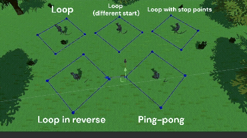

<h1>Hi, I'm Juan David!  <a href="https://www.ddevgames.com">Game Programmer and Unity Developer!</a>

Here you can find direct links to my projects' source code.

<h2>🕹️ My Games:</h2>

- <b>Personal Projects</b>
  - [Potion Seller](https://github.com/D4vidDG/Potion-Seller-Prototype/tree/master/Assets/Scripts): 3D puzzle crafting game. Craft potions and look at the wacky effects they have on your clients!
  - [Kitchen Khaos](https://github.com/pakasfand/Kitchen-Khaos/tree/master/Assets/Scripts): 3D action arcade game.  Your kitchen has been cursed and the utensils have come to life! Hurry up and clean all the plates and silverware before they run away.
  - [Afterlife](https://github.com/D4vidDG/Afterlife/tree/master/Assets/Scripts): 2D platformer. A bloody adventure where you discover the secrets of a haunted mansion risking your life and limbs!
- <b>Game Jams</b>
  - [The Last Sit](https://github.com/D4vidDG/GDTV_Jam_2024/tree/master/Assets/Scripts): Endless 2D top-down shooter.Survive the office apocalypse against waves of wheelchair-bound zombies!
  - [UN-Alive Heist](https://github.com/dicortesd/UN-ALIVE-HEIST/tree/main/UnAlive%20Heist/Assets/Scripts_D): 3D endless runner. Run across the colorful streets of Antioquia, Colombia as "El Sombreron", a mysterious man that has become a myth in the region. Protect your horse from obstacles!
- <b>JavaScript</b>
  - [Chess.js](https://github.com/objetos/chess-videogame/tree/master/src): Chess game developed from scrath in JavaScript using [p5.js](https://p5js.org/) and [p5.quadrille.js](https://objetos.github.io/p5.quadrille.js/).
- <b>Java</b>
  - [Tanks Battle Royale](https://github.com/D4vidDG/Final_Project): 2D top down shooter. Challenge your friends to epic tank battles with unique porwer-ups.

<h2>⭐ Featured scripts:</h2>

- <b>[AI Path Follower](https://github.com/D4vidDG/DDG_Utility_Scripts/tree/main/AI)</b>: Custom script that controls the movement of AI agents that follow a path with defined waypoints on a navigation mesh. The script enables options like starting from a certain waypoint on the path, traverse the path in reverse order, cycle the path in different ways, and stop momentarily at some waypoints.

  

- <b>Chess Scripts</b>
  - [Move Generation](https://github.com/objetos/chess-videogame/tree/master/src/MoveGeneration): Collection of scripts that generates legal moves based on the state of the board. Special rules (castling, enpassant, promotion) and king safety are implemented in `MoveGenerator.js`. Basic rules for moving pieces are implemented by the `Piece.js`
abstract class and its derived classes. Bitboard manipulation is done to perform calculations.
  - [Making/Unmaking moves in board](https://github.com/objetos/chess-videogame/blob/master/src/Board/Board.js): The `Board.js` class defines methods that provide information about the board and, most importantly, implements the logic to make moves on the board and unmake them keeping the original state of the board.
  - [Move Record](https://github.com/objetos/chess-videogame/blob/master/src/MoveRecord.js): Implements a record that holds the history of moves done by each side. It abides by the rules of [algebraic notation](https://www.chess.com/terms/chess-notation).

https://github.com/user-attachments/assets/6e8a4ef9-3f5f-4d6c-b0ab-32bc3f87f1f9

- <b>[Spell Casting](https://github.com/D4vidDG/Potion-Seller-Prototype/tree/master/Assets/Scripts/Crafting/Spelling)</b>: Group of scripts that implement spelling in <b>Potion Seller</b>. The game designer creates the spell's gesture in the editor. Then, the player draws the same gesture on the screen to cast the spell and  trigger some behavior in the color wheel.
  - [Spell Creator](https://github.com/D4vidDG/Potion-Seller-Prototype/blob/master/Assets/Scripts/Editor/SpellCreator.cs): Editor tool created in Unity. This tool allows the developer to create handmade signs and link a script to them. These signs are stored in data and can be recognized in-game by a gesture-recognition algorithm. When a gesture is detected, the associated script is executed.
  - [Spell Saver](https://github.com/D4vidDG/Potion-Seller-Prototype/blob/master/Assets/Scripts/Crafting/Spelling/SpellSaver.cs): Saves spells created with `SpellCreator.cs` as assets in Unity's asset database. Also, it receives a set of points and retrieves the information of the spell whose gesture matches those points.
  - [Spell Drawer](https://github.com/D4vidDG/Potion-Seller-Prototype/blob/master/Assets/Scripts/Crafting/Spelling/SpellDrawer.cs): Allows player to draw spells on screen. Then, it captures the points of the drawn line and fires an event if the line matches a spell saved in the asset database. 
  - [Spell Caster](https://github.com/D4vidDG/Potion-Seller-Prototype/blob/master/Assets/Scripts/Crafting/Spelling/SpellCaster.cs): Applies the effect of a spell to the color wheel.
  

  

- <b>UI</b>
  - [Shops](https://github.com/D4vidDG/GDTV_Jam_2024/tree/master/Assets/Scripts/UI/Shops)
- <b>[Extensions](https://github.com/D4vidDG/DDG_Utility_Scripts/blob/main/Extensions.cs)</b>: My own collection of functions that extend Unity API for special use cases.

<h2> 🤳 Connect with me:</h2>

[][linkedin]
[][youtube]
[][instagram]

[linkedin]: https://www.linkedin.com/in/juan-david-diaz-garcia-8b72781b0/
[youtube]: https://www.youtube.com/channel/UC4bj3kEuxM9S46AwiZzhmXg
[instagram]: https://www.instagram.com/jd_diazg1/
